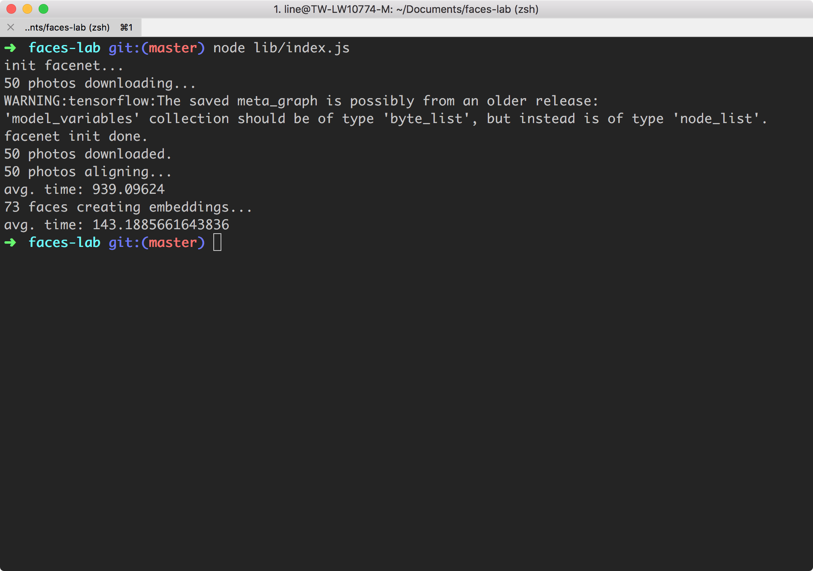

# faces-lab

This is a demo project used to test performance of [node-facenet](https://github.com/zixia/node-facenet)

| Method                                                                       | Avg. Time | Code                                                           |
| ---------------------------------------------------------------------------- | --------- | -------------------------------------------------------------- |
| [Facenet.align()](https://www.zixia.net/node-facenet/#Facenet+align)         | 939.09 ms | [align](src/modules/core/functions/createFaces.js#L10)         |
| [Facenet.embedding()](https://www.zixia.net/node-facenet/#Facenet+embedding) | 143.18 ms | [embedding](src/modules/core/functions/createEmbeddings.js#L8) |



## Getting Started

```
npm install

npm run dev
```
